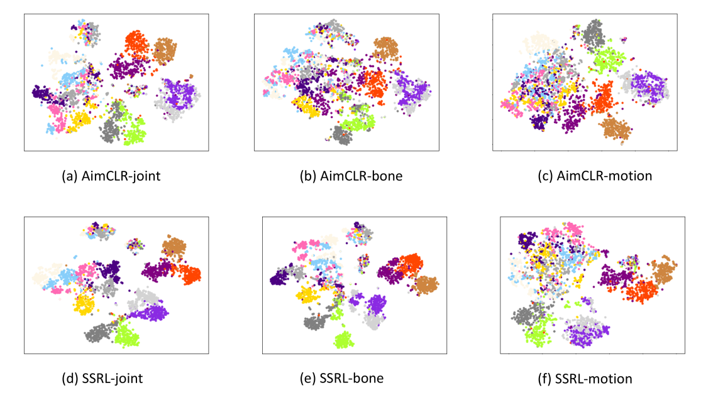

## Requirements
      
  
## SSRL
  This is an official PyTorch implementation of "SSRL: Self-supervised Spatial-temporal Representation Learning for 3D Action recognition"
  
## Data Preparation
- Download the raw data of [NTU RGB+D](https://github.com/shahroudy/NTURGB-D) and [PKU-MMD](https://www.icst.pku.edu.cn/struct/Projects/PKUMMD.html).
- For NTU RGB+D dataset, preprocess data with `tools/ntu_gendata.py`. For PKU-MMD dataset, preprocess data with `tools/pku_part1_gendata.py`.
- Then downsample the data to 50 frames with `feeder/preprocess_ntu.py` and `feeder/preprocess_pku.py`.

## Installation
  ```bash
# Install torchlight
$ cd torchlight
$ python setup.py install
$ cd ..
  
# Install other python libraries
$ pip install -r requirements.txt
  ```

## Unsupervised Pre-Training

Example for unsupervised pre-training of SSRL. You can change some settings of `.yaml` files in `config` folder.
```bash
# train on NTU RGB+D xsub joint stream
$ python main.py pretrain_SSRL --config config/pretext_sticlr_xsub_joint.yaml
```

## Linear Evaluation

Example for linear evaluation of SSRL. You can change `.yaml` files in `config` folder.
```bash
# Linear_eval on NTU RGB+D xsub joint stream
$ python main.py linear_evaluation --config config/ntu60/linear_eval/linear_eval_sticlr_xsub_joint.yaml
```

## Visualization

The [**t-SNE**](https://www.jmlr.org/papers/volume9/vandermaaten08a/vandermaaten08a.pdf) visualization of the embeddings after SSRL pre-training on NTU60-xsub.




## Trained models
Pre-trained models on NTU-60 are provided in `weights` folder.
You can download and test them with linear evaluation by changing the config file.


## Acknowledgement
The framework of our code is extended from the following repositories. We sincerely thank the authors for releasing the codes.
- The framework of our code is based on [AimCLR](https://github.com/Levigty/AimCLR).
- The encoder is based on [ST-GCN](https://github.com/yysijie/st-gcn/blob/master/OLD_README.md).


